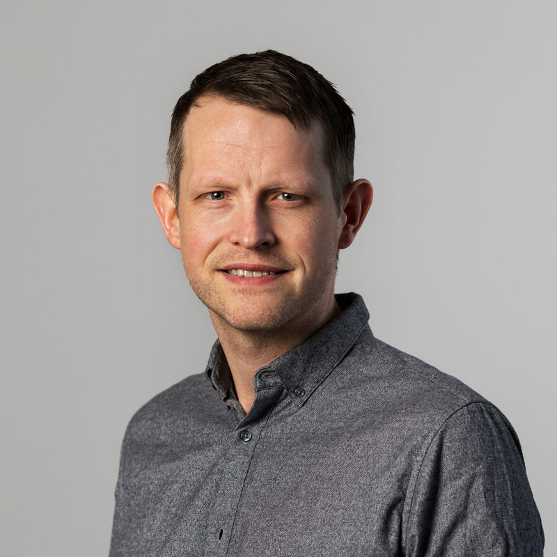

::: {.wrap}

```{=html}
<section class="page-head">
  <div>
    <div class="kicker">Om mig</div>
    <h1>Björn Thor Arnarson</h1>
    <p class="lead">Nationalekonom. Forskar om handel, globalisering och arbetsmarknaden i Norden, med särskilt fokus på Öresundsregionen.</p>
  </div>
  
</section>
```

::: {.sec}
::: {.label}
## Bakgrund
:::
::: {.prose}
Jag är född och uppvuxen på Island, studerade nationalekonomi vid Islands universitet, med ett utbytesår vid University of Oklahoma, och vid Boston University, och arbetade som ekonom i Reykjavik innan jag flyttade till Lund för doktorandstudier 2011.

I Lund, med Köpenhamn en kort tågresa bort över bron, blev jag tidigt intresserad av Öresundsregionen: två länder, två uppsättningar institutioner och en arbetsmarknad som i allt högre grad spänner över båda. Det intresset har format min forskning i mer än ett decennium.

Det mesta av min forskning bygger på danska och svenska registerdata. Under årens lopp har jag byggt upp en databas som sammanför och länkar dessa register, med flera kopplingar över gränsen. Resultatet är en unik datamängd som ligger till grund för flera av mina forskningsprojekt.
:::
:::

::: {.sec}
::: {.label}
## Kort presentation

Fri att citera.
:::
::: {style="font-size: 1.1875rem; line-height: 1.65; max-width: 760px;"}
Björn Thor Arnarson är nationalekonom och forskare vid ROCKWOOL Foundation Research Unit i Köpenhamn samt affilierad forskare vid Nationalekonomiska institutionen, Lunds universitet. Han använder danska och svenska registerdata för att studera hur globalisering, handel och kunskapsspridning påverkar företag och anställda, med särskilt fokus på Öresundsregionens gemensamma arbetsmarknad. Han disputerade vid Lunds universitet 2016 och var tidigare biträdande universitetslektor vid Köpenhamns universitet. Hans forskning har publicerats i bland annat Journal of International Economics och Scandinavian Journal of Economics.
:::
:::

```{=html}
<figure class="photo-band">
  
  <figcaption class="band-text">
    <div class="k">Öresundsregionen</div>
    <p class="q">Två länder, två uppsättningar institutioner och en arbetsmarknad över sundet.</p>
  </figcaption>
  <span class="credit">Foto: <a href="https://commons.wikimedia.org/wiki/File:%C3%96resundsbron_October_2017_02.jpg">Arild Vågen</a>, <a href="https://creativecommons.org/licenses/by-sa/4.0">CC BY-SA 4.0</a></span>
</figure>
```

::: {.sec}
::: {.label}
## Öresundsregionen
:::
::: {.dark-box}
[Hur påverkar en gemensam arbetsmarknad över sundet företag och anställda på båda sidor?]{.q}

::: {.items}
::: {}
Affilierad forskare vid Centrum för Öresundsstudier, Lunds universitet, 2017–2025.
:::
::: {}
Marie Skłodowska-Curie-projektet BRIDGE om arbetsmarknadsintegration och gränspendling, EU:s Horisont 2020.
:::
::: {}
EPRN-projektet *The Labour Market Effects of the Öresund Bridge*, 2017.
:::
::: {}
Pågående forskning om kunskapsspridning genom gränspendlare, med Jakob R. Munch, Morten G. Olsen och Emil A. L. Simonsen.
:::
:::
:::
:::

::: {.sec}
::: {.label}
## Expertområden
:::
::: {}
::: {.grid-2}
::: {.topic}
[Öresundsregionen och gränspendling]{.t}

:::
::: {.topic}
[Danska och svenska registerdata]{.t}

:::
::: {.topic}
[Handelspolitik och tullar]{.t}

:::
::: {.topic}
[Kunskapsspridning]{.t}

:::
::: {.topic}
[Globalisering, löner och välbefinnande]{.t}

:::
::: {.topic}
[Multinationella företag och FoU]{.t}

:::
::: {.topic}
[Export och exportfrämjande]{.t}

:::
::: {.topic}
[Islands ekonomi]{.t}

:::
:::

[Språk]{.sub-h style="display:block; margin-top: 36px;"}

::: {.cards-4}
::: {.card}
[Isländska]{.t}\
[Modersmål]{.n}

:::
::: {.card}
[Engelska]{.t}\
[Flytande]{.n}

:::
::: {.card}
[Svenska]{.t}\
[Flytande]{.n}

:::
::: {.card}
[Danska]{.t}\
[Goda kunskaper]{.n}

:::
:::
:::
:::

::: {.sec .sec-3}
::: {.label}
## Kontakt
:::
::: {}
[E-post]{.sub-h style="display:block;"}

[bth@rff.dk](mailto:bth@rff.dk){.contact-mail}
:::
::: {}
[Foto]{.sub-h style="display:block;"}

[Ladda ner i hög upplösning (JPG)](../images/bjorn.jpg)
:::
:::

:::
